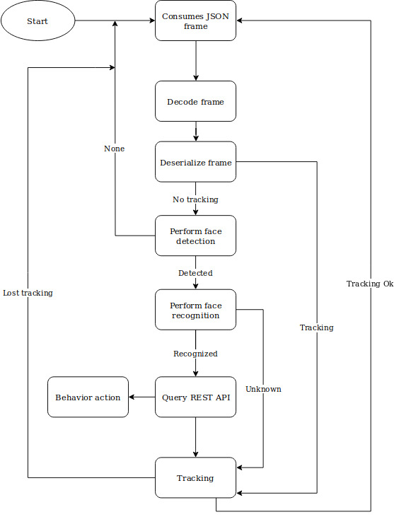

# SqueezeFace

## Program description :

The squeezeFace program is a command line software performing face recogntion on a video stream. It makes heavy use of multithreading to achieve a very small latency (< 25 ms). The system is based on OpenCV and the FaceNet Convolutional Neural Network. We use torch in order to implement the model.
The model is the pretrained openface model specifically designed in order to fit on low resources devices. 
The software allows us to train this network, infer the identity from a picture or a local webcam stream, or a remote webcam stream using kafka (cf. kafka documentation).
The CNN takes as an input a 64x64 image and output a list of 125 measurement of the face. Those mesurement don't vary a lot between images of similar individuals.
The measurements are then classified to output a name.
We use a threshold in order to accept or no the CNN result. The threshold is currently set at 80% but can be easily changed.

The classification is done using the linear SVM classifier which provided the best results for the smallest latency, going against our expectations.
The classifier is trained using sklearn and saved into a pickle time. The training process is entirely done in Python using the classifier.py executable in the src folder.

The complete flow is described in the following schematics :

/!\ *Run configure.sh in order to set up the local variable needed by the REST API and Kafka program.* /!\

## Training the classifier :

The pictures should be put in the training-images folder, in subfolders corresponding to the label and following the firstName-lastName syntax. The pictures should only include the corresponding individual and a unified background to avoid surprises.
The output folder can be specified but correspond to the aligned-images folder by default.
The training is realized using backpropagation on a Linear SVM classifier.
The linear SVM classifier gave consequently better results than the Random Forest classifier or the Gaussian SVM which were averaging at a 50% accuracy while the linear SVM is currently averaging at 80% for correct results.

## Using the program as a remote stream face detector :

The program is acting as a kafka consumer when using the --stream attribute. It follows the following architecture :

The program is dispatched among multiple threads, based on how many cameras are configured. The threads are programmed based on the cameraId provided in the _listCameras global variable, and the cameraId provided in the JSON by the producer.

In order to speedup the process, if a latency of more than one second is detected, the next frames are not processed until the stream is real-time again.

It is possible to implement your own actions to a recognition and authorization result by implementing the corresponding methods in the Utils class.
They take a void* as the parameter type and return a void* also.

## Using the program as a local webcam or video file face recognition :

The flow is basically the same as previously except we read directly the Mat object from the webcam.
In order to use the program with a video file, simply put the file path in the --video attribute.

The program read from the webcam with the '0' url by default. You can change this by simply overriding one line of the main file.

Some macros can be used to manage the program.
* MULTITHREAD allow multithreading.
* ISPLAY_STREAM allow the stream to be displayed. It is to be disabled on systems without a GUI.
* VERBOSE display more stdout output.
* EBUG display sensitive debugging informations.

## Command lines attributes

* --stream : Allow the program to behave as a remote stream processor. In order for the software to function, the REST server should
be available.

* --video : Run the program for a video file. Takes the path of the video file as the attribute value.

* --webcam : Added to the previous --video attribute with no value, it runs the program from a webcam stream ( 0 by default).

* --train : Traing the  classifier.

* --align : Align the pictures speicified by the align_folder_in attribute and save them to the align_folder_out folder.

* --align_folder_in : Optional. Folder containing the non-aligned images.

* --align_folder_out : Optional. Folder to contain the aligned images. *WARNING* : For this version, should always be aligned-images.

* --groupid : Specify the groupId of the consumer. Must be different on different machines. Default is testId2.

* --brokers : Specify the broker IP and port. Default is 179.106.230.91:9092

# Dependencies

* OpenCV > 3.1 (New tracking library required)
* cppkafka -librdkafka (gets isntalled to usr/local/lib, move to /usr/lib to get it to work)
* boost
* Openface and dependencies (openface directory should be put in the root of squeezecnn)
* restclient - curl
* rapidjson (headers only)